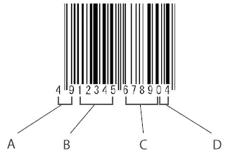
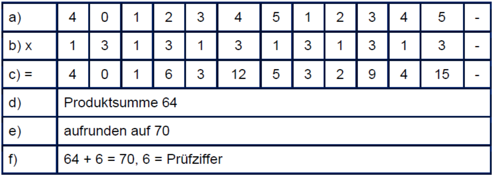

# Barcode Validator

Für ein Warenlager sollen die einzulagernden Artikel über einen Barcode identifiziert werden. Wird ein Artikel nicht im Warenbestand gefunden, so wird ein neuer Stammdatensatz für ihn angelegt. Leider kommt es aber ab und zu vor, dass falsche Etiketten auf den Artikeln kleben, die Barcodes aufweisen, die nicht zulässig für den Prozess sind. Damit das System keine falschen Artikel anlegt und somit "Leichen" in der Datenbank landen, soll zukünftig zumindest die formale Richtigkeit der erkannten Barcodes überprüft werden.

# Aufgabe

Schreibe ein Programm, dass eine Liste von Barcodes entgegennimmt und nur die korrekt erkannten Barcodes nebst zugeordnetem Barcodetyp zurück gibt. Zur Prüfung der Richtigkeit müssen die unten aufgeführten Kriterien erfüllt sein, sowie die Prüfziffer stimmen. 

Zulässige Barcodetypen sind vorerst GTIN und EAN8

## GTIN und EAN-8

* GTIN ist eine internationale, unverwechselbare Nummer zur Kennzeichnung von Produkten. Sie wird weltweit von der GS1 verwaltet und vergeben.
* Dargestellt werden können Zahlen.
* GTIN: 13-stellig
* EAN-8:  GTIN Kurznummer, 8-stellig, für Artikel mit kleinen Druckflächen



* A: Ländercode (2-stellig), 
* B: Herstellercode (5-stellig)
* C: Artikelnummer (5-Stellig),
* D: Prüfziffer

## Prüfzifferverfahren

* Die Prüfziffer für die Identifikationsnummern GTIN dient der Absicherung der erfassten Daten, d.h. sie stellt sicher, dass die vorausgegangene Ziffernfolge fehlerfrei eingegeben bzw. gelesen wurde.  
* Die Prüfziffer ergibt sich durch eine festdefinierte Rechenoperation, den Prüfziffern-Algorithmus, über die vorausgehenden Ziffern. Sie steht an 13. (bzw. 8.) Stelle der Identifikationsnummer und ist fester Bestandteil dieser Nummer.  
* Identifikationsnummern sind immer komplett anzugeben, also inklusive Prüfziffer. Diese Prüfziffer muss für jedeIdentifikationsnummer jeweils neu ermittelt werden.

Der Prüfziffern-Algorithmus des GS1-Systems basiert auf einer Gewichtung der einzelnen Ziffern der zu prüfenden Nummer mit den Faktoren "3" und "1"... von rechts nach links und dem Modulo 10. Mit anderen Worten ausgedrückt: 

* Die einzelnen Ziffern der GTIN-Nummer werden von rechts nach links -  also von hinten nach vorne - abwechselnd mit den Faktoren "3" und "1" multipliziert, wobei stets mit Faktor "3" begonnen wird. 
* Die Summe dieser einzelnen Produkte (Produktsumme) ist zu ermitteln. 
* Die Differenz zwischen der Produktsumme und dem nächsten vollen "Zehner" (Aufrundung) ergibt die Prüfziffer. Ergibt sich eine durch 10 teilbare Produktsumme, so ist die Prüfziffer gleich Null.

## Ermittlung der Prüfziffer am Beispiel einer GTIN-13



a) Schreiben Sie nebeneinander die Ziffern der betreffenden GTIN-Nummer (ausgenommen der letzten,der noch zu ermittelnden Prüfziffer).  
b) Sie setzen darunter von rechts nach links (wichtig) abwechselnd die Multiplikatoren 3 und 1.  
c) Sie multiplizieren a) mit b) und erhalten die einzelnen Produkte in c).  
d) Sie addieren die Ergebnisse von c) und erhalten die Produktsumme in d).  
e) Die Differenz (Aufrundung) dieser Summe auf den nächsten vollen "Zehner" ergibt die Prüfziffer. Ist die Differenz Null, ist auch die Prüfziffer Null.  
f) Die Prüfziffer ist in unserem Beispiel die Ziffer 6.  

## Testdaten

```
4012345123456  
4102430015329  
4020753015706  
70278358219069
8001841920573
8000500003787
50001593
541343
9002804150203
9010054115002
4711471147114711
5060108450515
5054903836766
7322540790146
20515713
27131336
20017224
27264096
28170280
90087066
4711
```