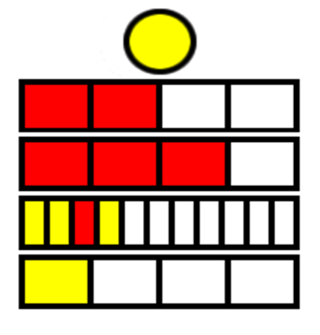

# Die Berlin Uhr

[Die Berlin-Uhr](https://de.wikipedia.org/wiki/Berlin-Uhr), auch inoffiziell Mengenlehreuhr genannt, ist eine öffentliche Uhr in Berlin. Sie wurde 1975 von dem Erfinder Dieter Binninger im Auftrag des Berliner Senats entwickelt und zeigt die Uhrzeit über eine Zahl von leuchtenden Lampen an.  

  

## Das Prinzip

* Die Anzeige der Zeit erfolgt in einem Stellenwertsystem zur Basis 5.
* Die Stunden und Minuten werden durch leuchtende Segmente in vier waagerecht untereinander angeordneten Streifen dargestellt.
* In der ersten, zweiten und vierten Zeile sind vier und in der dritten elf Leuchten angebracht.
* Die ersten beiden Zeilen zeigen mit roten Leuchten die Stunde an, wobei im oberen Streifen ein leuchtendes Segment für fünf Stunden und im unteren für eine Stunde steht.
* Die aktuelle Stunde ergibt sich aus der Addition der Werte.
* Entsprechend werden in den beiden unteren Zeilen die Minuten mit gelben Segmenten in Fünfer- und Einerschritten angezeigt.
* Die Leuchten für 15, 30 und 45 Minuten sind zur besseren Lesbarkeit rot.
* Über den Zeilen befindet sich ein rundes Blinklicht, das im Sekundentakt ein- oder ausgeschaltet wird.

## Die Aufgabe

Entwickle eine Applikation, die die Berlin-Uhr nachstellt. Dafür ist eine Implementierung zu wählen, bei der der Service “BerlinClock” die aktuelle Zeit im entsprechenden Format ausgibt. Ebenso ist ein Client zu entwickeln, der die Ausgabe konsumiert und graphisch - ähnlich der obigen Darstellung - darstellt.
