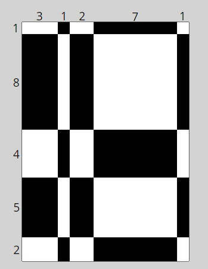

# Das seltsame Schachbrett

Ein exzentrischer Schachbrettbauer stellt gerne seltsame N x N Schachbretter her.
Anstatt alle Zeilen und Spalten auf seinen Schachbrettern gleich groß zu machen, stellt er gerne Schachbretter mit unterschiedlich großen Zeilen und Spalten her:  

  


Hier sind zum Beispiel die Spezifikationen seines neuesten 5x5-Schachbretts:  
```cs = [ 3, 1, 2, 7, 1 ]``` enthält die 5 Breiten der 5 Spalten.  
```rs = [ 1, 8, 4, 5, 2 ]``` enthält die 5 Höhen der 5 Zeilen.  

In den obigen Beispielen für ```cs``` und ```rs``` ist die Breite der 4. Spalte des Schachbretts 7, die Höhe der 2. Reihe des Schachbretts 8 usw.

Übrigens: Da ```Summe(cs) != Summe(rs)```, ist die Gesamtbreite des Schachbretts nicht unbedingt gleich der Gesamthöhe.

## Die Aufgabe

Der Schachbretthersteller möchte nun herausfinden, wie viel weißes und schwarzes Holz er benötigt, um die Flächen eines bestimmten Schachbretts zu bedecken, und bittet Sie daher, die **gesamte weiße Fläche** und die **gesamte schwarze Fläche** seines Bretts zu bestimmen.

# Wichtige Konvention  
Alle seine Schachbretter beginnen mit einer **WEISSEN ZELLE "OBEN LINKS"** und wechseln dann wie üblich zwischen Schwarz und Weiß.

Wenn wir uns also wieder auf ```cs``` und ```rs``` beziehen, wird die linke obere Zelle auf dem Brett durch die erste Spalte mit der Breite = 3 und die erste Reihe mit der Höhe = 1 definiert, so dass sie eine Fläche von 3*1 = 3 hat und aufgrund der Farbkonvention WEISS gefärbt ist.

Wenn wir uns nun auf dem Brett bewegen, können wir zum Beispiel die Zelle in Spalte 3 und Zeile 4 des Brettes betrachten - sie hat eine Breite = 2 und eine Höhe = 5, also eine Gesamtfläche von 2*5 = 10. Es ist **SCHWARZ** gefärbt, wie es durch das abwechselnde Schachbrett-Farbmuster und die Ausgangsbedingung, dass das linke obere Feld **WEISS** ist, bestimmt wird.

# Eingaben  
* Sie erhalten zwei Listen, ```cs``` und ```rs```, beide der Größe N.
* Die Breiten aller N Spalten, die in ```cs``` dargestellt werden, und die Höhen aller N Zeilen, die in ```rs``` dargestellt werden, sind immer ganze Zahlen und >= 1
* Die Größe des Schachbretts, d. h. der Wert von N, kann in einigen Tests von N = 1 bis zu N > 3000 variieren.

# Ausgabe  
Ein Tupel, der Form ```(total_white_area, total_black_area)```

# Beispiel  
Mit den Werten von cs und rs oben:

```cs = [ 3, 1, 2, 7, 1 ]``` 

```rs = [ 1, 8, 4, 5, 2 ]``` 

Es gibt insgesamt 25 Felder auf dem Schachbrett, von denen 13 weiß und 12 schwarz gefärbt sind.

Wenn Sie die Flächen der weißen Zellen addieren, sollten Sie feststellen, dass die Gesamtfläche der weißen Zellen 146 beträgt und die Gesamtfläche der schwarzen Zellen 134, so dass die Ausgabe (146, 134) lautet.

# Testmöglichkeit  
Folgender Sachverhalt kann als Überprüfung dienen: ```total_area_of_board = total_white_area + total_black_area = total_width * total_height = sum(cs) * sum(rs)```

Im obigen Beispiel ist zu beachten, dass ```total_white_area + total_black_area = 146 + 134 = 280```, was in der Tat gleich ist mit ```sum(cs) * sum(rs) = 14 * 20 = 280```